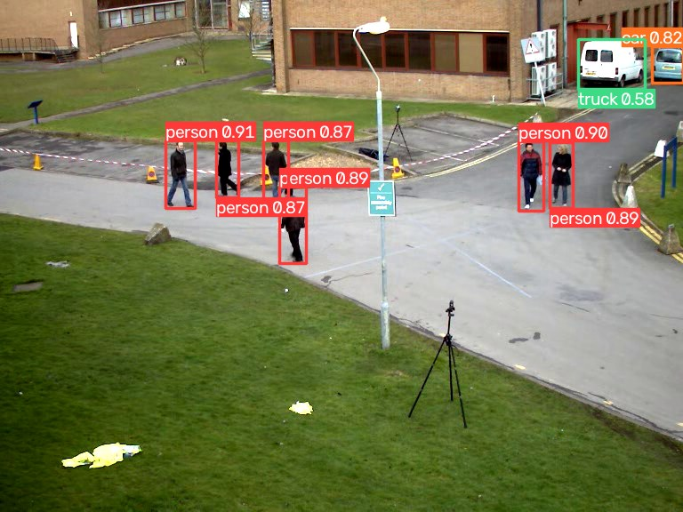
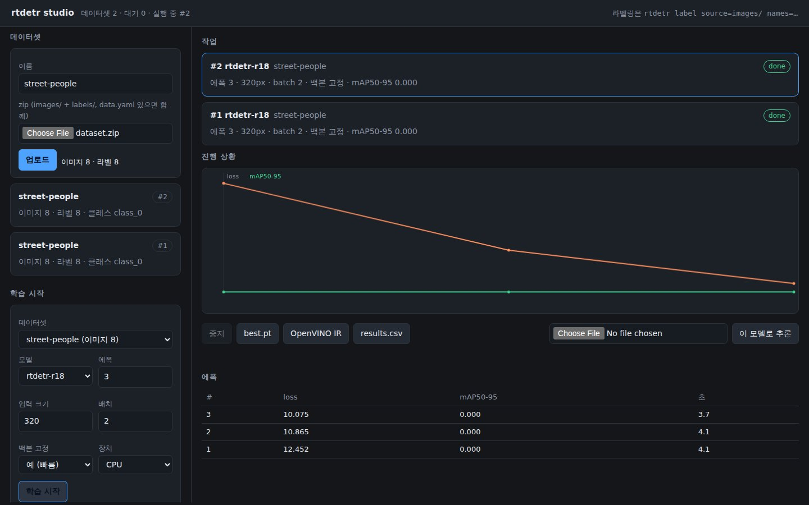

# rtdetr

Real-time object detection you can ship: **PyTorch training, OpenVINO inference,
100% Apache-2.0** — code and pretrained weights alike.



## Install

```bash
pip install rtdetr              # inference
pip install "rtdetr[train]"     # + training
```

## Detect

```python
from rtdetr import RTDETR

model = RTDETR("rtdetr-r18")          # COCO weights, downloaded on first use
r = model("bus.jpg", conf=0.5)[0]

r.boxes.xyxy, r.boxes.conf, r.boxes.cls   # plain numpy
r.names[int(r.boxes.cls[0])]              # "person"
r.plot(); r.save(); r.show()
```

Point it at an image, a folder, a glob, a video, an RTSP stream, a webcam index,
or a numpy array. Long sources stream:

```python
for r in model.predict(0, stream=True, show=True):   # webcam, q or Esc quits
    print(r.boxes.xyxyn)

model.track("clip.mp4")        # adds r.boxes.id
```

## Label, train and deploy in a browser

```bash
pip install "rtdetr[studio]"
rtdetr studio                                  # http://127.0.0.1:8080
```



Upload a dataset, train, watch the curve, download the weights and the OpenVINO
IR. For drawing the boxes in the first place:

```bash
rtdetr label source=images/ names=can,bottle   # auto-label, then fix
```

## Train

```python
model = RTDETR("rtdetr-r18")
model.train(data="data.yaml", epochs=100, imgsz=640, batch=8, device=0)
model.val(data="data.yaml").box.map50
model.export(format="openvino", half=True)     # IR + labels.txt
```

```yaml
# data.yaml
path: /data/cans
train: images/train
val: images/val
names: {0: can, 1: bottle}
```

## Command line

```bash
rtdetr predict model=rtdetr-r18 source=bus.jpg conf=0.5
rtdetr train   model=rtdetr-r18 data=data.yaml epochs=100
rtdetr val     model=best.pt data=data.yaml
rtdetr export  model=best.pt format=openvino half=true
rtdetr label   source=images/ names=can,bottle
rtdetr studio  port=8080
```

## Models

| name | params | COCO AP | notes |
| --- | --- | --- | --- |
| `rtdetr-r18` | 20M | 46.4 | fastest |
| `rtdetr-r34` | 31M | 48.9 | |
| `rtdetr-r50` | 43M | 53.1 | most accurate |

## Docs

* [Using the model](docs/usage.md) — sources, results, tracking, saving
* [Labelling](docs/labeling.md) — the browser tool, auto-labelling
* [Studio](docs/studio.md) — the web app: datasets, jobs, artefacts, API
* [Training](docs/training.md) — datasets, validation, export, CLI
* [Weights](docs/weights.md) — the mirror, building it, offline use
* [Performance](docs/performance.md) — measured speeds and how to improve them
* [Design](docs/design.md) — architecture and provenance
* [Development](docs/contributing.md) — tests, releases

## 한국어

```python
from rtdetr import RTDETR

model = RTDETR("rtdetr-r18")               # COCO 사전학습 가중치 자동 다운로드
model("bus.jpg", conf=0.5)[0].save()       # 결과 이미지 저장
model.train(data="data.yaml", epochs=100)  # 내 데이터로 학습
model.export(format="openvino", half=True) # 배포용 IR + labels.txt
```

가중치 캐시는 `~/.rtdetr/`, 사내 미러는 `RTDETR_ASSETS_URL` 환경변수로 지정합니다.

## License

Apache-2.0 — see [LICENSE](LICENSE) and [NOTICE](NOTICE).
