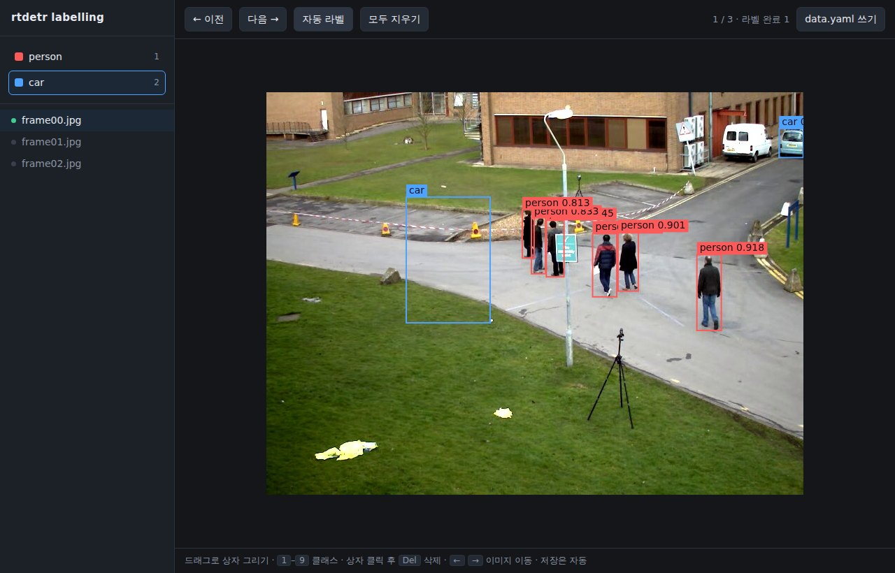

# Labelling

Back to the [README](../README.md).

```bash
rtdetr label source=images/ names=can,bottle
```

That opens `http://127.0.0.1:8000` with the images in that folder, and writes
`labels/*.txt` next to them — the same files [training](training.md) reads. It is
stdlib-only and never leaves your machine.



## Working in it

| | |
| --- | --- |
| draw a box | drag on the image |
| pick a class | click it, or press <kbd>1</kbd>–<kbd>9</kbd> |
| select a box | click it (then <kbd>Del</kbd> to remove, or a number key to relabel) |
| move between images | <kbd>←</kbd> <kbd>→</kbd>, or click the file list |
| save | automatic, on every change |

Green dots in the file list mark images that have a label file. An image with no
objects is worth labelling too — press *모두 지우기* and move on; that writes an
empty file, which trains as "nothing here" rather than being skipped.

## Auto-label first, then correct

The point of labelling inside this package is that it already has a detector:

```bash
rtdetr label source=images/ names=person,car model=rtdetr-r18
```

*자동 라벨* runs the model on the current image and drops in the boxes it finds
that match your class names (matched by name, case-insensitive; classes the
model does not know are left to you). Fixing boxes is far quicker than drawing
them, and you can point `model=` at your own `best.pt` once you have one — the
first hundred images bootstrap the model that labels the next thousand.

## Options

| key | meaning |
| --- | --- |
| `source=` | folder of images (searched recursively) |
| `names=` | the classes, comma separated, in the order they get their indices |
| `model=` | model to auto-label with (default `rtdetr-r18`) |
| `autolabel=false` | disable auto-labelling entirely |
| `labels=` | where to write labels (default: the `labels/` mirror of `source`) |
| `port=` `host=` `open=false` | serving options |

*data.yaml 쓰기* writes a `data.yaml` pointing at what you just labelled, so you
can go straight to:

```bash
rtdetr train model=rtdetr-r18 data=data.yaml epochs=50
```

## When to use something else

This is a labelling tool, not an annotation platform: no polygons, no teams, no
review workflow, no keypoints. If you need those, export from
[CVAT](https://github.com/cvat-ai/cvat) (MIT) or
[Label Studio](https://github.com/HumanSignal/label-studio) (Apache-2.0) in YOLO
format and train on that instead — the layout is identical.
