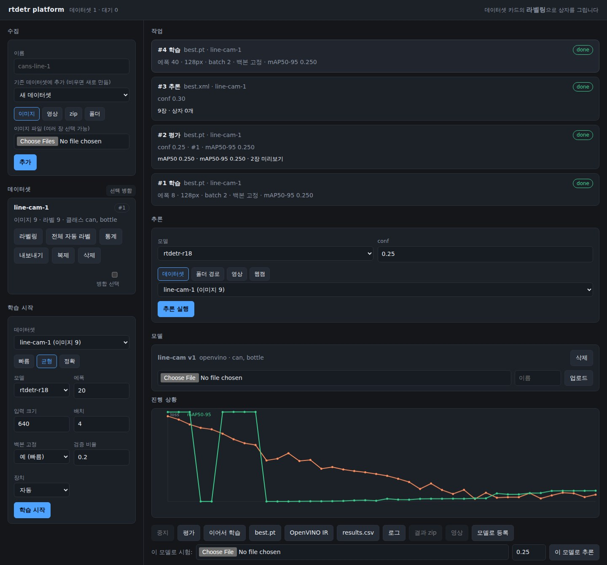
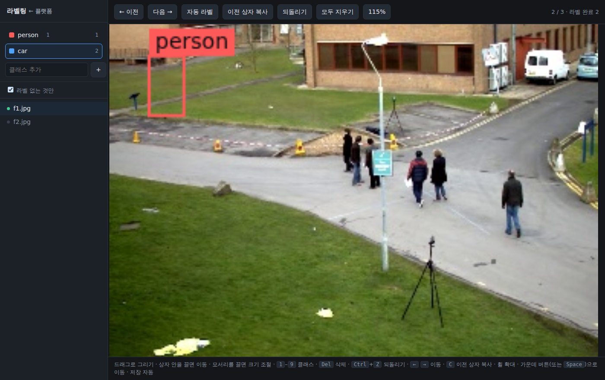

# rtdetr platform

Label images, train on them, watch the run, take the model away — in a browser,
on one machine. It is a separate application that uses the `rtdetr` package; the
package itself stays a library with a CLI and no web dependencies.

```bash
pip install -r platform/requirements.txt
python platform/run.py                 # http://127.0.0.1:8080
```



[PLAN.md](PLAN.md) is what this is meant to become, and what is missing today.

## The loop

1. **Collect** — four ways into a dataset, and all of them can add to one that
   already exists: pick image files, upload a video and sample frames from it
   (interval and cap are yours), upload a zip (images, plus labels and a
   data.yaml if you have them), or register a folder already on this machine
   (`python platform/run.py label --source images/ --names can,bottle`).
2. **Label** — *라벨링* on the dataset card. Drag to draw, drag inside a box to
   move it, drag a corner to resize, <kbd>1</kbd>–<kbd>9</kbd> to set the class,
   <kbd>Del</kbd> to remove, <kbd>Ctrl</kbd>+<kbd>Z</kbd> to undo. Saving is
   automatic. The wheel zooms and the middle button (or <kbd>Space</kbd>) pans,
   for boxes too small to place at fit-to-window. <kbd>C</kbd> copies the
   previous image's boxes — a fixed camera repeats itself. Classes can be added
   from the sidebar and show how many boxes each has, and the file list can hide
   what is already labelled.
3. **Keep the set honest** — *통계* counts boxes per class and flags what usually
   bites: images with no label, labels with no boxes, specks under 0.1% of the
   frame. *복제* takes a snapshot before a risky relabel, *병합* combines sets and
   remaps class indices by name (index 0 rarely means the same thing in two
   datasets), and an image can be dropped with its label from the labelling page.
4. **Let the model do the first pass** — *자동 라벨* fills the current image;
   *전체 자동 라벨* queues a job over every unlabelled image in the dataset.
   Correcting boxes is far quicker than drawing them, and once you have a
   `best.pt` you can point the auto-labeller at it.
5. **Train** — a preset (빠름 / 균형 / 정확) or your own model, epochs, image size,
   batch, backbone freezing and device. Jobs queue and run one at a time; the
   loss and mAP curve updates per epoch; *중지* stops at the next epoch boundary;
   *이어서 학습* continues a finished run with more epochs in the same directory;
   every run keeps a `train.log`, and a failure carries the end of it.
6. **See what it learned** — *평가* scores the run on its validation split and
   draws every one of those frames with the truth in green and the prediction in
   its class colour, next to per-class AP. A single mAP says whether to keep
   going; this says what to fix.
7. **Run it on everything else** — *추론* takes a dataset, a folder path on this
   machine, or an uploaded video, and queues it like a training job: progress
   while it works, then a zip of the drawn frames (with `results.json` next to
   them) and, for a video, `annotated.mp4`. *웹캠* opens the browser's camera and
   posts a frame every 400 ms, so you see the model on live video even when the
   server is somewhere else.
8. **Take it away** — `best.pt`, the OpenVINO IR as a zip (exported when a run
   finishes), `results.csv`. *모델로 등록* gives the run a name (the IR if it has
   one, otherwise the weights) and it then appears wherever a model is chosen —
   auto-labelling, batch inference, the webcam. A `.pt`, `.onnx` or IR from
   elsewhere can be uploaded into the same list.



## Where things live

Everything sits under `rtdetr-platform/` in the directory you start from —
`--data /some/path` or `$RTDETR_PLATFORM_HOME` moves it:

```
rtdetr-platform/
  platform.db          datasets, jobs, per-epoch numbers
  datasets/<name>/     uploaded datasets (registered folders stay where they are)
  runs/job<id>/        weights/, openvino/, results.csv, summary.json
                       (inference jobs: images/, results.json, annotated.mp4)
  models/<name>/       models uploaded from outside
```

## API

The pages are only clients of these, so a script can do anything the UI does:

| endpoint | |
| --- | --- |
| `POST /api/datasets` | multipart: `name`, `archive` (zip) |
| `POST /api/datasets/images` | multipart: `name`, `files` (images), optional `dataset_id` |
| `POST /api/datasets/video` | multipart: `name`, `video`, `every`, `max_frames` |
| `GET /api/datasets/{id}/export` | the dataset as a zip |
| `GET /api/datasets/{id}/stats` | boxes per class, and what looks wrong |
| `DELETE /api/datasets/{id}/images/{index}` | drop one image and its label |
| `POST /api/datasets/{id}/duplicate` | a copy to experiment on |
| `POST /api/datasets/merge` | `{ids, name}` — one set, class indices remapped |
| `DELETE /api/datasets/{id}` | |
| `POST /api/datasets/local` | `{path, name, names}` — register a folder in place |
| `GET /api/datasets` · `GET /api/datasets/{id}` | the second lists the images |
| `GET`/`POST /api/datasets/{id}/labels/{index}` | read and write one image's boxes |
| `POST /api/datasets/{id}/autolabel/{index}` | boxes for one image, from a model |
| `POST /api/datasets/{id}/autolabel` | queue a pass over the whole dataset |
| `POST /api/datasets/{id}/classes` | rename or add classes; data.yaml follows |
| `GET /api/models` | the registry, plus the names that download themselves |
| `POST /api/models` | `{job_id, name, note}` — register a finished run |
| `POST /api/models/upload` | multipart: `name`, `file` (.pt/.onnx/.xml), `classes` |
| `DELETE /api/models/{id}` | forget it (files stay) |
| `POST /api/predict` | multipart: `model`, `conf`, and one of `dataset_id`, `path`, `video` |
| `POST /api/preview` | multipart: `model`, `conf`, `image` → annotated JPEG, one frame |
| `POST /api/jobs` | `{dataset_id, model, epochs, imgsz, batch, freeze, device}` |
| `GET /api/jobs` · `GET /api/jobs/{id}` | the second includes per-epoch rows |
| `GET /api/jobs/{id}/stream` | server-sent events: progress, then a status |
| `POST /api/jobs/{id}/cancel` | |
| `POST /api/jobs/{id}/resume` | `{add_epochs}` — continue a finished run |
| `POST /api/jobs/{id}/evaluate` | `{conf}` — queue a scoring pass with pictures |
| `GET /api/jobs/{id}/report` · `/eval/{name}` | the numbers, and the pictures |
| `GET /api/jobs/{id}/download/{weights,openvino,results,log,predictions,video}` | |
| `POST /api/jobs/{id}/predict` | multipart: `image`, `conf` → annotated JPEG |

## What it is not

One process, one SQLite file, one folder. No accounts, no permissions, no
quotas, no scheduler, and one job at a time. That is the point: a workstation or
a mini PC beside a line needs no infrastructure, and the data never leaves it.

When that stops being true — several people, several GPUs, work that must
survive a restart — the things to change are the worker (onto a real queue) and
the storage (onto a service), not the package underneath.

Other limits worth knowing:

* Boxes only. Polygons, keypoints, review workflows and team assignment are out
  of scope; [CVAT](https://github.com/cvat-ai/cvat) (MIT) and
  [Label Studio](https://github.com/HumanSignal/label-studio) (Apache-2.0) export
  the same layout, so you can label there and train here.
* Training runs in this process, so restarting the server ends a run. Jobs left
  behind are marked failed on the next start rather than spinning forever.
* It binds `127.0.0.1` by default and has no authentication. Behind `--host
  0.0.0.0` it is open to whoever can reach the port.

## Tests

```bash
pytest platform/tests
```
